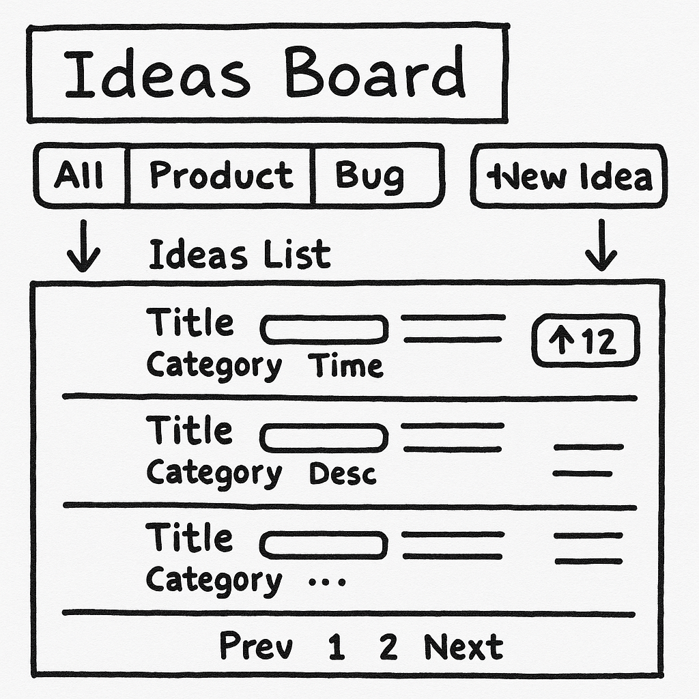
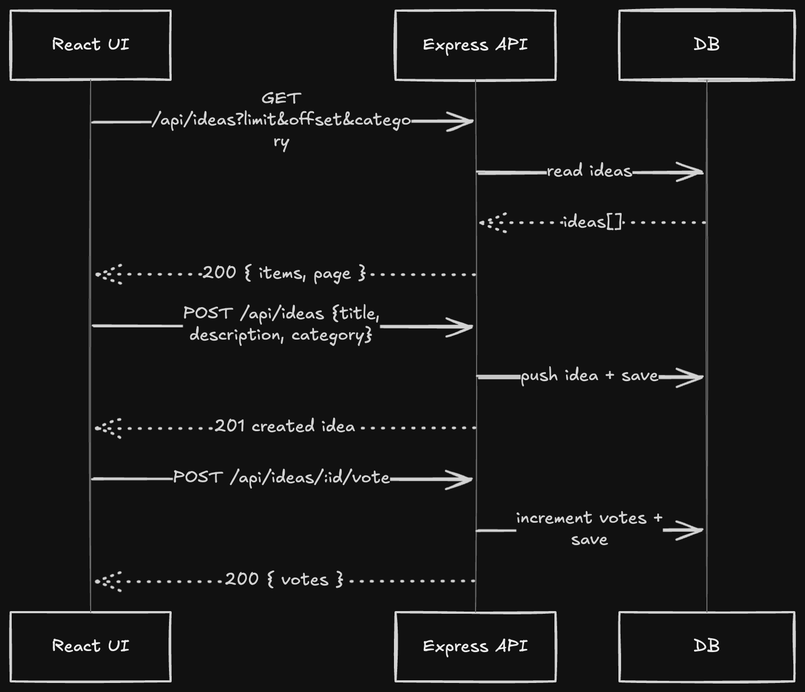

# Ideas Board — Level 1 (README)

_No‑fluff mini full‑stack app. React (frontend) + Node/Express (backend) + **PostgreSQL**. No auth._

---

## 0) Problem Statement

Build an **Ideas Board** where users can:
- **Create** an idea with `title`, `description`, and `category` (`product|bug|ux|other`).
- **Browse** the latest ideas, optionally filter by **category**.
- **Upvote** an idea to increase its `votes` count.

You will design the UI, model data in a DB, build minimal APIs, and wire the UI to the backend.

---

## The Flow (Do this step‑by‑step)

Each step has a short **What to do** and a **Hint**. Follow in order. ✅

### Step 1 — Sketch the UI (Napkin)
**What to do:** Draw a simple wireframe of the app’s main screen.  
**Hint:** Use this napkin sketch as inspiration.




---

### Step 2 — Identify Frontend Components
**What to do:** List the React components you’ll need and what each does.  
**Hint (a possible set):**
- `App` — page shell, holds global state for filter and list.
- `CategoryFilter` — pills/dropdown to choose category.
- `IdeaForm` — create idea (title, description, category).
- `IdeaList` — renders a list of ideas from server data.
- `IdeaCard` — one card: title, description, meta, **Vote** button.
- `Toast` (optional) — transient success/error messages.


---

### Step 3 — Identify State
**What to do:** Decide what lives in **UI state** and what is **server data**.  
**Hint (start here):**

**UI / View State**
- `selectedCategory` — `"all" | "product" | "bug" | "ux" | "other"`
- `showNewIdeaModal` — boolean
- Form 2 way binding?: `title`, `description`, `category`
- `votes[]` vote state for each idea 


---

### Step 4 — Design the Database
**What to do:** Create a PostgreSQL table for ideas.  
**Hint (copy this schema):**
```sql


CREATE TABLE IF NOT EXISTS ideas (
  id SERIAL PRIMARY KEY DEFAULT,
  title TEXT NOT NULL,
  description TEXT NOT NULL,
  category TEXT NOT NULL,
  votes INT NOT NULL DEFAULT 0,
  created_at TIMESTAMPTZ NOT NULL DEFAULT now()
);

```


---

### Step 5 — Build Backend Endpoints
**What to do:** Expose minimal Express routes that talk to the DB.  
**Hint (contract to follow):**

```
GET    /api/ideas?category=all|product|bug|ux|other[&limit=50]
POST   /api/ideas                               // body: { title, description, category }
POST   /api/ideas/:id/vote                      // increments votes by 1
DELETE /api/ideas/:id                           // optional (dev/admin only)
```

**Responses**
- **GET** (newest first; default `category=all`)
```json
{ "items": [
  { "id":"...", "title":"...", "description":"...", "category":"ux", "votes":12, "createdAt":"..." }
]}
```
- **POST /api/ideas** → `201 Created` with created idea.  
- **POST /api/ideas/:id/vote** → `{ "votes": 13 }`  
- **DELETE** → `204 No Content`

**Errors**
- `400` `{ "error": "Invalid title/description/category" }`
- `404` `{ "error": "Not found" }`

**Minimal SQL the routes will run**
```sql
-- list
SELECT id, title, description, category, votes, created_at AS "createdAt"
FROM ideas
WHERE ($1 = 'all' OR category = $1)
ORDER BY created_at DESC
LIMIT COALESCE($2::int, 50);

-- create
INSERT INTO ideas (title, description, category)
VALUES ($1,$2,$3)
RETURNING id, title, description, category, votes, created_at AS "createdAt";

-- vote
UPDATE ideas SET votes = votes + 1
WHERE id = $1
RETURNING votes;
```


---

### Step 6 — Wire Up the Frontend
**What to do:** Call your API from React and render the list.  
**Hint (data‑flow sketch):**



- On load or category change → `GET /api/ideas?category=...`
- On create → `POST /api/ideas` then prepend item to list
- On vote → `POST /api/ideas/:id/vote` then update card
- Use loading/error states and optimistic UI for a snappy feel


---

## Acceptance Criteria

- [ ] Users can create ideas with validation (title 1‑80, description 1‑300, valid category)
- [ ] Users can view newest‑first ideas, and filter by category
- [ ] Upvoting increases the vote count and updates the card
- [ ] Clear loading + error states; buttons disabled while pending
- [ ] Uses PostgreSQL (no in‑memory store)

---

## Stretch (Optional)

- [ ] Sort tabs: **Latest** vs **Top (votes)**  
- [ ] Search by title keyword  

Happy building! 🚀
